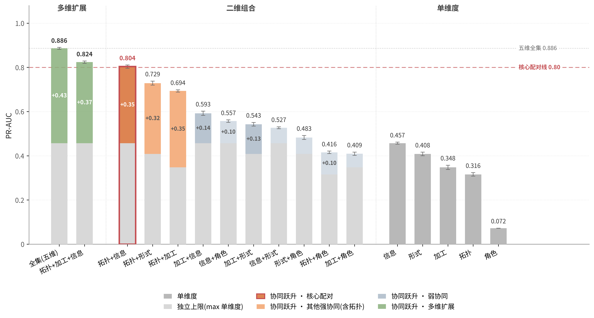
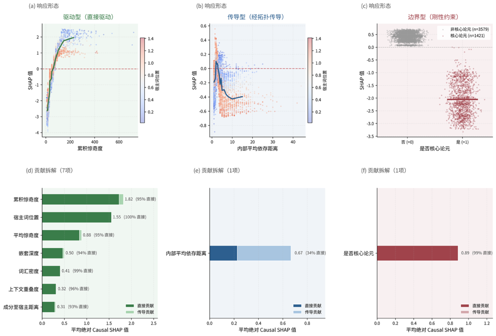
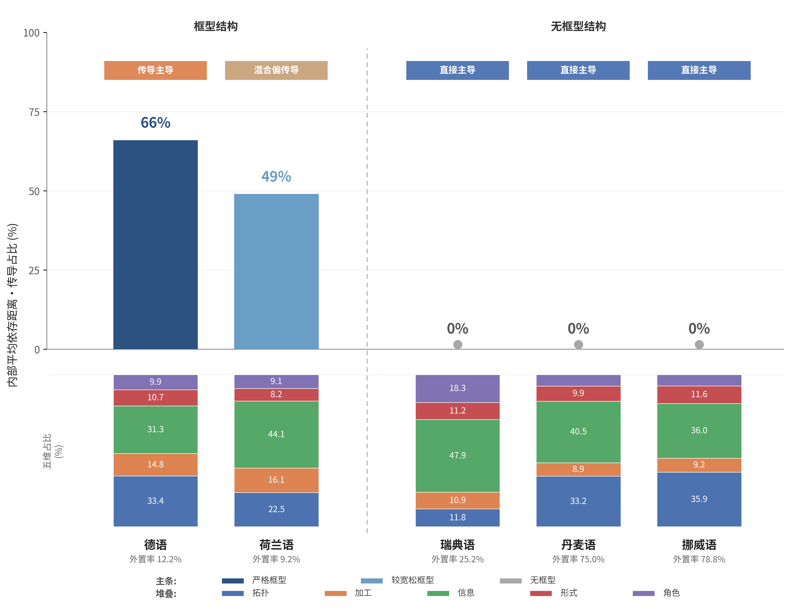

# 框型结构对约束分工的组织作用
### 基于德语"破框"的可解释机器学习研究

> **The Organizing Role of the Sentential Frame in Constraint Division of Labor**
> *An Interpretable Machine Learning Study of German Ausklammerung*

[](https://creativecommons.org/licenses/by/4.0/)
[]()
[]()
[]()
[-red)]()

---

> 📌 **本仓库为论文的在线补充材料**，含术语与分布讨论（A）、数据基础与方法（B）、协同结构的完整证据（C）、角色分化的完整证据（D）、框型组织的完整证据（E）。正文中"附录 X"或"附表 X"均指本仓库对应部分。

---

## 📄 论文文档 / Paper Documents

| 文件 | PDF | DOCX |
|:---|:---:|:---:|
| **正文** Main Paper | [📥 main_paper.pdf](docs/main_paper.pdf) | [📥 main_paper.docx](docs/main_paper.docx) |
| **附录** Appendix | [📥 appendix.pdf](docs/appendix.pdf) | [📥 appendix.docx](docs/appendix.docx) |

---

## 📖 摘要 / Abstract

破框（Ausklammerung）集中体现了德语框型结构中的多重约束交互，但其协同机制尚缺乏系统实证。本文基于汉堡依存树库（HDT）153,035 句科技新闻语料，运用可解释机器学习发现：各约束以**信息负荷与拓扑条件的非线性协同**为核心，分化为**"驱动—传导—边界"三重角色**。信息负荷连续直接驱动，认知压力经拓扑条件间接传导，配价关系构成刚性边界。德语 V2/VL 配置对短语与从句产生相反调节；荷兰语及三种非框型北日耳曼语的对比进一步表明，传导路径随框型结构有无而出现或消失，驱动与边界跨语言稳定。本文将破框解释单位由单个约束转向**框型结构所组织的约束分工**，为"人驱复杂适应系统"所论生物普遍性与语言特殊性的区分提供句法实证。

**关键词**：德语破框 · 框型结构 · 约束分工 · 作用路径 · 可解释机器学习

---

## 🔑 核心发现 / Key Findings

<table>
  <tr>
    <td align="center" width="33%">
      <h3>F1 · 非线性协同</h3>
      <i>Non-linear Synergy</i>
    </td>
    <td align="center" width="33%">
      <h3>F2 · 驱动—传导—边界</h3>
      <i>Three-Role Division</i>
    </td>
    <td align="center" width="33%">
      <h3>F3 · 框型结构组织</h3>
      <i>Frame Organization</i>
    </td>
  </tr>
  <tr>
    <td align="center"></td>
    <td align="center"></td>
    <td align="center"></td>
  </tr>
  <tr>
    <td valign="top">
      <p>信息负荷与拓扑许可的二维联合预测力达全集模型的 <b>89%</b>。</p>
      <ul>
        <li>🎯 PR-AUC: <b>0.804</b></li>
        <li>📊 单维上限: 0.46 / 0.32</li>
        <li>❌ 其他二维组合均 ≤ 0.73</li>
      </ul>
    </td>
    <td valign="top">
      <p>同一加工压力（MDD）经拓扑条件<b>间接传导</b>，配价关系构成<b>刚性边界</b>。</p>
      <ul>
        <li>🚀 <b>驱动</b>：信息负荷直接连续</li>
        <li>🔁 <b>传导</b>：MDD 间接占比 <b>70.2%</b></li>
        <li>🛡 <b>边界</b>：配价直接 99%</li>
      </ul>
    </td>
    <td valign="top">
      <p>V2/VL 配置产生<b>反向</b>效应；非框型语中传导路径<b>消失</b>。</p>
      <ul>
        <li>🔀 句内：V2/VL 短语 vs 从句反向</li>
        <li>🌍 跨语：荷兰语 8/9 一致</li>
        <li>🚫 非框型 V2：传导路径 <b>0%</b></li>
      </ul>
    </td>
  </tr>
</table>

---

## 📊 研究概览 / Research at a Glance

| 项目 / Item | 内容 / Detail |
|:---|:---|
| 🗂 **主语料 / Primary Corpus** | 汉堡依存树库 HDT 2.13，153,035 句科技新闻 |
| 🌐 **跨语言验证 / Cross-Linguistic** | 荷兰语 Alpino · 德语 GSD（科技新闻 vs 维基百科）· 瑞典语 Talbanken |
| 🔬 **核心方法 / Core Method** | XGBoost + SHAP + Causal SHAP 路径分解 + mGPT/PC 算法 DAG |
| 📐 **特征维度 / Features** | 5 维 9 项（拓扑 / 加工 / 信息 / 形式 / 角色） |
| 📈 **破框发生率 / Extraposition Rate** | 12.21%（HDT 全集）· 7.24%（GSD） |
| 🎯 **路径分类阈值 / Path Threshold** | 70%（直接 / 传导主导分界） |
| 🛡 **稳健性 / Robustness** | 5% 标签不对称扰动：8/9 特征 100% 稳定 |

---

## 🗂 仓库结构 / Repository Structure

```
ausklammerung-supplementary-materials/
├── 📄 README.md                    ← 本页 (You are here)
├── 📜 LICENSE                       ← CC-BY-4.0
├── 📝 CITATION.cff                  ← 引用元数据
│
├── 📂 docs/                         ← 论文与附录原文
│   ├── main_paper.{pdf,docx}
│   └── appendix.{pdf,docx}
│
├── 📚 appendices/                   ← 附录章节结构化导航
│   ├── A1_terminology_boundary.md
│   ├── A2_cross_study_positioning.md
│   ├── A3_density_vs_weight.md
│   ├── B_data_and_methods/
│   ├── C_synergy_evidence/
│   ├── D_role_differentiation/
│   └── E_frame_organization/
│
├── 🖼 figures/                      ← 正文与附录全部图（400 DPI PNG）
├── 📊 results/                      ← 关键数值表（CSV）
└── 💾 data/                         ← 数据集来源与许可证说明
```

---

## 📚 在线补充材料目录 / Online Appendices

### 附录 A · 术语与分布讨论 / Terminology & Distribution

| 章节 | 内容 | 链接 |
|:---|:---|:---:|
| **A.1** | Ausklammerung 与 Extraposition 的概念边界 | [📖](appendices/A1_terminology_boundary.md) |
| **A.2** | 破框率的跨研究定位 | [📖](appendices/A2_cross_study_positioning.md) |
| **A.3** | 信息密度与物理重量的可分离性 | [📖](appendices/A3_density_vs_weight.md) |

### 附录 B–E · 数据 / 方法 / 完整证据 / Data, Methods & Full Evidence

| 章节 | 主题 | 链接 |
|:---|:---|:---:|
| **B** | 数据基础与方法（语料处理、变量操作化、模型设置） | [📖](appendices/B_data_and_methods/) |
| **C** | 协同结构的完整证据（模型对比、消融、交互效应） | [📖](appendices/C_synergy_evidence/) |
| **D** | 角色分化的完整证据（Causal SHAP 路径分解、稳健性） | [📖](appendices/D_role_differentiation/) |
| **E** | 框型组织的完整证据（V2/VL 对比、跨语言、跨语体） | [📖](appendices/E_frame_organization/) |

> 完整附录 PDF（含全部排版图表与数学表达）见 [`docs/appendix.pdf`](docs/appendix.pdf)。

---

## 💾 数据来源 / Data Sources

本研究全部基于公开依存树库，原始数据请按各树库许可证从下列地址获取：

| 树库 / Treebank | 语言 / Language | 来源 / Source | 许可证 / License |
|:---|:---:|:---:|:---:|
| **HDT** | 德语 (主语料) | [UD_German-HDT](https://github.com/UniversalDependencies/UD_German-HDT) | CC-BY-NC-SA 4.0 |
| **Alpino** | 荷兰语 | [UD_Dutch-Alpino](https://github.com/UniversalDependencies/UD_Dutch-Alpino) | CC-BY-SA 4.0 |
| **GSD** | 德语 (跨语体) | [UD_German-GSD](https://github.com/UniversalDependencies/UD_German-GSD) | CC-BY-SA 4.0 |
| **Talbanken** | 瑞典语 | [UD_Swedish-Talbanken](https://github.com/UniversalDependencies/UD_Swedish-Talbanken) | CC-BY-SA 4.0 |

详见 [`data/README.md`](data/README.md)。

---

## 📝 引用 / Citation

如本仓库材料对您的研究有帮助，请引用本论文：
*If the materials in this repository contribute to your research, please cite the paper:*

```bibtex
@unpublished{fu2026ausklammerung,
  author    = {Fu, Xuchen},
  title     = {框型结构对约束分工的组织作用——基于德语"破框"的可解释机器学习研究},
  year      = {2026},
  note      = {Paper submitted to 全国高校德语专业本科生学术创新大赛.
               Supplementary materials available at
               https://github.com/fxc1206/ausklammerung-supplementary-materials}
}
```

---

## 💻 源代码 / Source Code

> Source code (data extraction, feature engineering, modeling, and Causal SHAP analysis pipeline) **will be released upon publication of this work**.
>
> 本研究的源代码（含数据抽取、特征工程、建模与 Causal SHAP 分析全流程）将在论文正式发表后公开。

完整方法描述见正文第二章及附录 B；变量操作化、模型选择、路径分解的全部技术细节均在附录中给出，足以支撑独立实现。

For methodology inquiries, please refer to Section 2 of the main paper and Appendix B.

---

## 📧 联系方式 / Contact

- **作者 / Author**：付栩辰 Xuchen Fu (Patrick)
- **指导教师 / Supervisor**：刘海涛 Haitao Liu
- **机构 / Institution**：复旦大学 Fudan University
- **联系邮箱 / Email**：[fxc1206@qq.com](mailto:fxc1206@qq.com)

---

## 📜 许可证 / License

本仓库内容（论文文本、附录、图表、数据表）采用
[**Creative Commons Attribution 4.0 International (CC BY 4.0)**](https://creativecommons.org/licenses/by/4.0/) 许可证。

The contents of this repository (paper text, appendices, figures, and data tables) are licensed under
[**CC BY 4.0**](https://creativecommons.org/licenses/by/4.0/).

> 数据集本身不在本仓库重新分发，请遵循各原始树库的许可证条款。
> *Datasets themselves are not redistributed in this repository; please comply with the license terms of the respective original treebanks.*

---

<div align="center">

*Last updated: April 2026*

</div>
