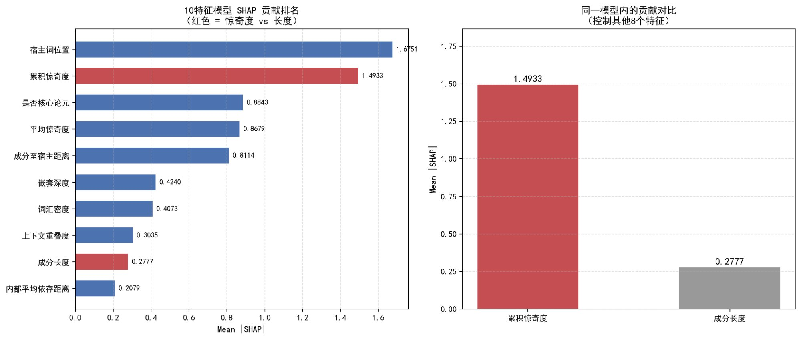

# 附录 A.3 · 信息密度与物理重量的可分离性

> **Appendix A.3 · The Separability of Information Density and Physical Weight**
>
> 本节论证以惊奇度（而非词数）度量信息负荷的前提：信息密度与物理重量为可分离的预测维度。
>
> *This section establishes the prerequisite for using surprisal (rather than word count) as the measure of information load: information density and physical weight are separable predictive dimensions.*

---

## 数据层面的直接证据

本文以惊奇度而非词数度量信息负荷，其前提是**信息密度与物理重量为可分离的维度**。本文数据直接支持这一前提：

| 指标 | 数值 |
|:---|:---:|
| 累积惊奇度 与 成分长度 共线性 | R² = **0.99**（高度共线） |
| 控制长度后惊奇度残差的 PR-AUC | 0.46 → **0.44**（保留 96% 预测力） |
| 累积惊奇度的 SHAP 边际贡献 | **1.49** |
| 成分长度的 SHAP 边际贡献 | 0.28（十项特征中排名倒数第二） |
| 边际贡献比 | **5.4 ×** |

**信息密度因此并非物理长度的代理变量，而是独立的预测维度**（详见 [附图 A1](../figures/figA1_density_vs_weight.png)）。

> *附图 A1 · 10 特征模型 SHAP 贡献排名：累积惊奇度与成分长度的对比*

---

## 理论基础

这一可分离性在理论上有明确基础：

1. **整合代价的语义实质**：整合代价的主要增量源于**新话语指称**而非词数本身（Gibson，1998：12）。
2. **信息论的反向论证**：增加词数可通过提高后续词的可预测性而降低其惊奇度，使整体加工负担**不升反降**（Jaeger，2010）。

**长度与加工难度的等价假设因此在理论上并不成立。**

---

## 独立证据的多方印证

独立的语料库与实验证据从多个方向印证了这一区分：

### 语料库证据

- **德语关系从句**：累积惊奇度与长度虽高度共线（r = 0.98），但前者在逻辑回归中系统性优于后者作为外置预测因子；平均惊奇度则与长度近乎**正交**（r ≈ 0），表明信息量与词数捕捉的是不同维度（Voigtmann & Speyer，2021）。

### 实验证据

- **德语诱导产出**：成分自身长度对外置的可接受度和产出选择均**无显著影响**（Cortés Rodríguez et al.，2024）。
- **英语关系从句外置**：加工难度主要受**预期语境**而非成分长度调节（Levy et al.，2012；Francis & Michaelis，2014）。

---

## 排除替代假说：结构复杂度

上述证据表明信息密度是超越长度的预测维度，但需排除一个可能的替代假说——**剩余变异或许来自结构复杂度而非信息密度**。

这一假说在 IDS 语法中亦有支持：其后场亲和力层级以结构复杂度而非长度定义"体量"（Zifonun et al.，1997：1651、1671），其作者后来进一步承认**多维度因素的组合才能获得经验上充分的画面**（Zifonun，2015：49）。

然而，**结构复杂度本身并不构成独立的预测力**：

| 证据 | 来源 | 结论 |
|:---|:---|:---|
| 控制词数后，含额外关系从句的 PP 与不含的版本在外置可接受度上无差异 | Weber, 2019 | 复杂度独立于长度无效应 |
| 仅含 3–6 词的短 PP 在分词结构中规律性出现在后场，动因为语义邻接而非形式重量 | Vinckel, 2006: 82 | 复杂度不能解释短成分外置 |

**两项证据共同表明**：物理长度与结构复杂度均不能解释外置选择的全部变异，而本文数据中**惊奇度在控制长度后仍保留近乎完整的预测力**（见本节首段数值）。

惊奇度作为信息论意义上的可预测性度量，其所捕捉的剩余变异因此归属于**信息密度维度**。

---

## 相关图表 / Related Figures

- [`figA1_density_vs_weight.png`](../figures/figA1_density_vs_weight.png)（附图 A1 · 10 特征 SHAP 贡献对比）

## 参考文献 / References

- CORTÉS RODRÍGUEZ M, PIÑANGO M M, FRAZIER L. The processing and acceptability of relative clause extraposition in German [Slides]. 2024.
- FRANCIS E J, MICHAELIS L A. Why move? How weight and discourse factors combine to predict relative clause extraposition in English [J]. *Theoretical Linguistics*, 2014.
- GIBSON E. Linguistic complexity: locality of syntactic dependencies [J]. *Cognition*, 1998, 68(1): 1-76.
- JAEGER T F. Redundancy and reduction: Speakers manage syntactic information density [J]. *Cognitive Psychology*, 2010, 61(1): 23-62.
- LEVY R, FEDORENKO E, BREEN M, et al. The processing of extraposed structures in English [J]. *Cognition*, 2012, 122(1): 12-36.
- VINCKEL H. *Die diskursstrategische Bedeutung des Nachfelds im Deutschen* [M]. Wiesbaden: Deutscher Universitäts-Verlag, 2006.
- VOIGTMANN S, SPEYER A. Information density and the extraposition of German relative clauses [J]. *Frontiers in Psychology*, 2021, 12: 650969.
- WEBER S. *Nominal Modification in Language Production: Extraposition of Prepositional Phrases in German* [D]. Frankfurt am Main: Johann Wolfgang Goethe-Universität, 2019.
- ZIFONUN G, HOFFMANN L, STRECKER B. *Grammatik der deutschen Sprache* [M]. Berlin/New York: Walter de Gruyter, 1997.
- ZIFONUN G. Der rechte Rand in der IDS-Grammatik: Evidenzen und Probleme [C] // VINCKEL-ROISIN H. *Das Nachfeld im Deutschen*. Berlin/Boston: De Gruyter, 2015: 25-51.
